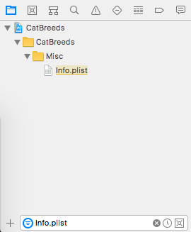

Programmatic-Layout Tutorial
============================

### Introduction

This tutorial teaches programmatic layout (PL) by demonstrating conversion of an app's user interface (UI) from [Interface Builder](https://youtu.be/dl0CbKYUFTY) (IB) to PL.

### Definitions

IB is [descended](https://en.wikipedia.org/wiki/Interface_Builder) from a visual UI editor originally created for the NeXTSTEP operating system. As of Xcode 4, IB is integrated into Xcode itself. Using the IB approach, developers drag UI elements from the Object library onto a storyboard or XIB and then set most or all Auto Layout constraints and UI-element properties using the IB UI. A storyboard is an XML-backed representation of the UI elements of, and connections among, one or more view controllers and their views. A XIB is an XML-backed representation of the UI elements of one view. The Objective-C runtime instantiates views and view controllers represented by XIBs and storyboards.

The PL approach eschews IB. Using PL, developers instantiate UI elements, set their properties, and set Auto Layout constraints using Objective-C or Swift.

In practice, developers often use IB and PL in tandem.  Production-quality apps are likely to have some UI properties and/or constraints that must be set in code, for example if the app has themes or animations. Ardent PL developers cannot entirely avoid IB because editing launch screens requires use of IB.

### Plusses and Minuses of IB _Vis à Vis_ PL

Proponents of IB cite, _inter alia_, the following advantages:
* IB is more approachable for iOS-development learners, perhaps explaining why many iOS-development-learning [resources](http://web.stanford.edu/class/cs193p/cgi-bin/drupal/) [teach](https://store.raywenderlich.com/products/swift-apprentice) the IB approach. There are [exception](https://www.youtube.com/watch?v=9RydRg0ZKaI)s.
* Apple is promoting use of IB in WWDC sessions, suggesting that IB is more future-proof than PL. Future iOS features might not be available to PL developers in the same way that multitasking on iPad is not available to developers who have not adapted size classes.
* Creating a UI in IB is faster and easier to iterate on. In concrete terms, dragging UI elements around a storyboard and fiddling with their properties until the UI takes useful shape is easy, but creating a UI in code without knowing ahead of time _exactly_ what form the UI should take is nigh-impossible. In practice, therefore, PL requires use of some other design tool, for example Sketch or a napkin.
* An app that uses IB has fewer lines of Swift or Objective-C code than an identically functioning app that uses PL. [Less code is better.](https://blog.codinghorror.com/the-best-code-is-no-code-at-all/) There is an argument that the nuts and bolts of UI creation and layout are not central to an app’s functionality, so developers should offload those nuts and bolts, to the extent possible, to IB in the same way that developers sometimes offload creation and maintenance of their object graphs to CoreData.
* Relatedly, because most iOS-UI sample code demonstrates use of IB, not PL, initial use of PL sometimes requires more research. For example, when the author of this tutorial (the Author) was adding a scroll view to his PL-based app, [Conjugar](), he had a 🐻 of a time setting up the constraints and ownership graph so that the scroll view functioned properly because, in part, of the dearth of PL sample code on the Internet.

Proponents of PL cite, _inter alia_, the following disadvantages of IB:
* Using IB does mean less Objective-C or Swift code, but IB does use "code" in the form of an undocumented, arguably inscrutable XML file. In one production iOS [app](https://github.com/vermont42/RaceRunner), this [file](https://github.com/vermont42/RaceRunner/blob/master/RaceRunner/Main.storyboard) is 2503 lines long.
* IB's XML format is subject to change between Xcode versions. Changes in format can cause warnings that the developer has to fix. [Two](https://itunes.apple.com/us/app/immigration/id777319358) [apps](https://itunes.apple.com/us/app/racerunner-run-tracking-app/id1065017082) developed by this tutorial's author experienced these warnings, examples of which appear in the following screenshot.


* Because the IB file format is not backwards-compatible, old storyboards and XIBs cannot even be opened in newer versions of Xcode, a situation decried [here](http://www.lapcatsoftware.com/articles/working-without-a-nib-part-11.html). UIs created in IB are, in that sense, ticking time-bombs. As Swift evolves, old PL code may not compile, but it can always be opened in Xcode and grokked by the developer.
* IB hides implementation details from the iOS-development-learner. For example, an IB learner learning about tab bars might learn to click a view controller in the storyboard and click Editor -> Embed In -> Tab Bar Controller. The learner might not realize that a `UITabBarController` gets instantiated at runtime. A PL learner learning about tab bars can't avoid instantiating `UITabBarController` explicitly. The PL approach therefore fosters deeper understanding of UIKit.
* By requiring the developer to set, by hand, the value of every color, font, padding, and constraint constant, the IB approach
violates the [DRY](http://deviq.com/don-t-repeat-yourself/) principle. Global changes to colors, fonts, paddings, and constraint constants are tedious and error-prone. With the PL approach, these values are set once in code and are easy to change globally.
* As in [quantum theory](https://www.sciencedaily.com/releases/1998/02/980227055013.htm), the act of observing a storyboard or XIB affects its reality. That is to say, opening a storyboard or XIB in IB "dirties" the underlying file, a change picked up by source control unless discarded. In a world where reviewers of pull requests rightfully expect every commit in a pull request to reflect developer intent, these no-op changes are problematic.
* Finally, the inscrutable nature of XIB and storyboard files makes resolving merge conflicts in a team environment challenging. Admittedly, these conflicts can be minimized, but not eliminated, by putting each view controller in its own storyboard.

### Tutorial

This tutorial takes no position as to whether PL or IB is the better approach. But because of PL's many benefits, this tutorial _does_ argue that developers who know only IB would benefit from learning PL. A desire to facilitate this learning prompted this tutorial, which begins after the following disclaimer: The tutorial assumes working knowledge of iOS development with IB and, in particular, Auto Layout. Readers not in possession of that knowledge might find helpful [CS193P](https://www.youtube.com/watch?v=71pyOB4TPRE), which was the tutorial's author's entrée to iOS development.

1\. Clone, build, and run the [starter project](https://github.com/vermont42/CatBreedsIB).

2\. Poke around the code and storyboard. The app is intended to be simple enough to grok without much effort but complicated enough to demonstrate various PL techniques.

The app is intended to be simple to understand, but here are some comments.
* There is no way to edit attributed strings in IB, so the app uses a sort of Markdown-lite that allows different formatting for headings, subheadings, and URLs. See `StringExtensions.swift` and `Credits.swift` for implementation and use, respectively. This technique, developed for [RaceRunner](https://itunes.apple.com/us/app/racerunner-run-tracking-app/id1065017082) and used by [Conjugar](https://itunes.apple.com/us/app/conjugar/id1236500467), works well in this and other simple use cases despite not providing the full power of Markdown.

* There is, [on information and belief](https://dictionary.law.com/Default.aspx?selected=954), no way to set tab- or navigation-bar fonts in IB, so the app uses an app-delegate-initiated approach from StackOverflow.
* App-and-button icons are from [The Noun Project](https://thenounproject.com). Consider using this website if you need professional-grade icons but do not have the skill to make them or the budget to commission them.

* The app's color palette is from [Coolors](https://coolors.co). The Author is not an artist, so he uses this website for suggestions of harmonious color palettes.

* There are no custom `UIView` subclasses in the IB app, but this will change in the course of IB conversion.

3\. You might think that the first step of converting an app from IB to PL is to delete the storyboard, but that is not the case because the storyboard will serve as a reference as you create the views. So don't delete the storyboard. But you do need to tell the runtime not to use the storyboard to create the UI. So in the file `Info.plist`, find the key `Main storyboard file base name`, click it, and press the `delete` key.

As an aside, when this tutorial refers to a file in the project, the easiest way to find the file is to click the Project Navigator button in the top-left corner of Xcode and type the filename in the search bar, as shown in this screenshot.




4\. Resist temptation. Do not build _or_ run. The runtime no longer knows what UI to show, so running would be pointless. Instead, _tell_ the runtime what UI to show by adding the following line, just before the `return`, in `application(_: didFinishLaunchingWithOptions:)` in `AppDelegate.swift`:

```
window = UIWindow(frame: UIScreen.main.bounds)
let mainTabBarVC = MainTabBarVC()
window?.rootViewController = mainTabBarVC
window?.makeKeyAndVisible()
```

The purpose of this code is to make an instance of `MainTabBarVC` the root of the app's UI. This code serves the same purpose, conceptually speaking, as the checkbox "Is Initial View Controller" in storyboards.

5\. Note the compilation error `Use of unresolved identifier 'MainTabBarVC'`. This error occurs because in the IB-based app, the storyboard specified a non-subclassed instance of `UITabBarController` as the root of the app's UI, but the PL-based app will use a named subclass, `MainTabBarController`, of `UITabBarController`, and you need to create that subclass. Why a named subclass? The named subclass will have business logic about what tabs to create, what to name them, and what icons to use for them.

Before you do that, here is an aside about roots and navigation. The root of an app's UI depends on how navigation works in that app. A single-screen app would have a `UIViewController` subclass as its root. A single-screen app that uses a `UINavigationController` would have have a `UINavigationController` subclass as its root. This subclass would instantiate the app's first `UIViewController`. An app whose navigation is based on a third-party hamburger menu like [SideMenu](https://github.com/jonkykong/SideMenu) would have, as its root, a `UIViewController` subclass that sets up the hamburger menu.

Back to the custom `UITabBarController` subclass. In the group `ViewControllers`, create an empty file called `MainTabBarVC.swift`. Paste the following code into it:

```
import UIKit

class MainTabBarVC: UITabBarController {
  // 0
  internal static let tabs = ["Browse", "Credits"]

  init() {
    super.init(nibName: nil, bundle: nil)
    // 1
    let breedBrowseNavC = UINavigationController(rootViewController: BreedBrowseVC())
    // 2
    breedBrowseNavC.tabBarItem = UITabBarItem(title: MainTabBarVC.tabs[0], image: UIImage(named: MainTabBarVC.tabs[0]), selectedImage: nil)
    // 3
    let creditsVC = CreditsVC()
    // 4
    creditsVC.tabBarItem = UITabBarItem(title: MainTabBarVC.tabs[1], image: UIImage(named: MainTabBarVC.tabs[1]), selectedImage: nil)
    //5
    viewControllers = [breedBrowseNavC, creditsVC]
  }

  // 6
  required init?(coder aDecoder: NSCoder) {
    fatalError("init(coder:) has not been implemented.")
  }
}
```

Here are some explanations of this file:

// 0: This line is the "model" of the tab bar. This model could be fancier, perhaps a separate struct or class, but an array of tab names works fine in this app.

// 1: This line create the left-hand `UIViewController`, a `BreedBrowseVC`, and embeds it in a `UINavigationController`, which is necessary because the user will drill down from this screen to a `BreedDetailVC` with information about a specific cat breed. If you needed custom `UINavigationController` behavior, you could use a subclass of that class.

// 2: This line set the name, "Browse", and the icon, a sitting cat, of the `BreedBrowseVC`'s `UITabBarItem`.

// 3: This line creates the right-hand `UIViewController`, a `CreditsVC`. There is no drill-down from credits, so there is no embedding in a `UINavigationController`.

// 4: This line set the name, "Credits", and the icon, a jumping cat, of the `CreditsVC`'s `UITabBarItem`.

// 5: This line tells the `UITabBarController` to manage the browse and credits `UIViewController`s.

// 6: Swift's initializer rules require implementation of this initializer, but because you won't be using a storyboard, the initializer need not have a functional implementation. More details [here](https://stackoverflow.com/a/24036440).

6\. Feel free to build, but _don't_ run. If you do, you will see a crash caused by the fact that `BreedBrowseVC`'s `UITableView` expects to be instantiated from a storyboard, which isn't happening. `CreditsVC`'s `UITextView` has a similar problem. For an initial fix, comment out the definition of `BreedBrowseVC`'s in `BreedBrowseVC.swift` and insert the following definition:

```
class BreedBrowseVC: UIViewController {
  // 0
  var breedBrowseView: BreedBrowseView {
    return view as! BreedBrowseView
  }

  // 1
  override func loadView() {
    view = BreedBrowseView(frame: UIScreen.main.bounds)
  }
}
```

(Why comment out the previous definition and not replace it? As you are converting a real app, keeping the previous definition around as a reference is helpful as you implement the new definition.)

When you use storyboards, the views of your `UIViewController`s often need not be custom `UIView` subclasses. Instead, you just set properties of the view in IB. But when you use the PL approach, making every `UIViewController`'s `view` property an instance of a custom `UIView` subclass is helpful because those `UIView`s need a lot of code to set up controls and Auto Layout constraints.

Here are some explanations of this definition:

// 0:

As mentioned earlier, with the PL approach, `UIViewController`s own instances of named `UIView` subclasses as their `view` property. Giving this property an appropriately typed alias, in this case `breedBrowseView`, allows clean access to this named-subclass instance throughout the `UIViewController`. If you only referred to the instance by its `view` name/property, you would need to cast it to a `BreedBrowseView` every time you referred to `BreedBrowseView`-specific properties and methods.

The use of force-unwrap here is controversial but carefully considered by the [author](https://twitter.com/vermont42) of this tutorial.

// 1:

`loadView()` is a `UIViewController`-lifecycle method. This is a method you may not have seen if you have been doing IB-based development. Why not? If you've been using IB, the runtime, not your code, has been responding to calls of this method. As the [documentation](https://developer.apple.com/documentation/uikit/uiviewcontroller/1621454-loadview) states,

>The view controller calls this method when its view property is requested but is currently nil. This method loads or creates a view and assigns it to the view property.

This implementation creates an instance of `BreedBrowseView` and assigns it to the `BreedBrowseVC`'s `view` property.

7\. As mentioned earlier, using the PL approach, `BreedBrowseVC`'s `view` is an instance of a `UIView` subclass. This subclass needs a definition, so in the `Views` group, create a file called `BreedBrowseView.swift` and give it the following contents:

```
import UIKit

class BreedBrowseView: UIView {
  required init(coder aDecoder: NSCoder) {
    fatalError("init(coder:) has not been implemented.")
  }

  override init(frame: CGRect) {
    super.init(frame: frame)
  }
}
```

This tutorial will fill out this definition in a later Step.

8\. Continuing the fix for the runtime crash, comment out the definition of `CreditsVC`'s in `CreditsVC.swift` and insert the following definition:

```
class CreditsVC: UIViewController {
  var creditsView: CreditsView {
    return view as! CreditsView
  }

  override func loadView() {
    view = CreditsView(frame: UIScreen.main.bounds)
  }
}
```

The explanation of `BreedBrowseVC`'s definition applies to this definition as well.

9\. As in Step 7, in the `Views` group, create a file called `CreditsView.swift` and give it the following contents:

```
import UIKit

class CreditsView: UIView {
  required init(coder aDecoder: NSCoder) {
    fatalError("init(coder:) has not been implemented.")
  }

  override init(frame: CGRect) {
    super.init(frame: frame)
  }
}
```

This tutorial will fill out this definition in a later Step.

Build and run. You now have a functional PL-based app!


10\. The next step is complete in the starter project, but, in general, the next step in the conversion of an app from IB to PL is to take an inventory of the colors currently being used in the storyboard and put them in a data structure that your UI code can use. In a production app, these colors, and their names, might be specified in a style guide from a designer. As noted earlier, the colors in this app are from Coolors. Take a look at `Colors.swift`, which contains the five Coolors colors. With respect to naming the colors, you can choose names that reflect the actual colors, as in this app. But you might also choose more-abstract names like `button`, `alert`, or `body`. More-abstract names have the advantage that they are not tied to particular RGB values and therefore remain useful if those RGB values change radically. The disadvantage is that, for example, if you want to use the `body` color for something that is not text body, you will need to make an alias of that color.

11\. You may have noticed that the `Browse` tab lacks the original table of cats. The fix for this is to implement the view that holds this table. Replace the contents of `BreedBrowseView.swift` with the following:

```
class BreedBrowseView: UIView {
  // 0
  internal let table: UITableView = {
    let table = UITableView()
    // 1
    table.backgroundColor = Colors.blackish
    // 2
    table.translatesAutoresizingMaskIntoConstraints = false
    return table
  } ()

  required init(coder aDecoder: NSCoder) {
    fatalError("init(coder:) has not been implemented.")
  }

  // 3
  override init(frame: CGRect) {
    super.init(frame: frame)
    // 4
    addSubview(table)
    // 5
    table.topAnchor.constraint(equalTo: safeAreaLayoutGuide.topAnchor).isActive = true
    table.leadingAnchor.constraint(equalTo: layoutMarginsGuide.leadingAnchor).isActive = true
    table.trailingAnchor.constraint(equalTo: layoutMarginsGuide.trailingAnchor).isActive = true
    table.bottomAnchor.constraint(equalTo: safeAreaLayoutGuide.bottomAnchor).isActive = true
  }

  // 6
  func setupTable(dataSource: UITableViewDataSource, delegate: UITableViewDelegate) {
    table.dataSource = dataSource
    table.delegate = delegate
    table.register(BreedCell.self, forCellReuseIdentifier: "\(BreedCell.self)")
  }
}
```

Here are some explanations of this new code:

// 0: Using the PL approach, controls within `UIView`s are properties of those `UIView`s. This particular `UIView` subclass has one control, a `UITableView`, and that gets defined and created here.

When defining controls like `table`, the question of access level arises. `private` works if no other class needs access to the control. `internal` is appropriate in cases like this where another class, `BreedBrowseVC`, needs access to the control. Later Steps show examples of `private` controls.

// 1: This line shows the [DRY](http://deviq.com/don-t-repeat-yourself/) power of PL. If your designer decides to give `blackish` a slightly different RGB value, just change the definition of `blackish` in `Colors.swift`, and all controls using that color get the new RGB values. Using the IB approach, you would need to change that color _every_ place it appears in the storyboard.

The preceding sentence was not entirely accurate. As of Xcode 9 and iOS 11, [named colors](https://medium.com/bobo-shone/how-to-use-named-color-in-xcode-9-d7149d270a16) are available, so storyboard colors need only be set once. There are no named fonts or named paddings, however, so fonts and paddings in IB still violate DRY. Examples of DRY fonts and paddings appear later in this tutorial.

// 2: When you're using PL, you must set `translatesAutoresizingMaskIntoConstraints` to `false` for every control. If you don't, your view [won't appear](https://www.innoq.com/en/blog/ios-auto-layout-problem/). More explanation can be found [here](https://stackoverflow.com/a/47801753).

// 3: In the PL approach, the `init()` function of `UIView` subclasses has two jobs: add controls it owns as subviews of itself and constrain these controls using Auto Layout or some other approach. More details below.

// 4: This line is self-explanatory but critical.

// 5: This section of `init()` constrains the `UIView`'s controls, in this case just `table`. There are many approaches to coding Auto Layout constraints. This app uses [NSLayoutAnchor](https://developer.apple.com/documentation/uikit/nslayoutanchor). Sticking with first-party solutions, you could use [NSLayoutConstraint](https://developer.apple.com/documentation/uikit/nslayoutconstraint) or [Visual Format Language](https://developer.apple.com/library/content/documentation/UserExperience/Conceptual/AutolayoutPG/VisualFormatLanguage.html) (VFL). The Author avoids `NSLayoutConstraint` because the API is verbose and error-prone. He avoid VFL because its use of `String`s is error-prone and does not leverage type-checking to catch programmer errors.

Paul Hudson has [written up](https://www.hackingwithswift.com/articles/9/best-alternatives-to-auto-layout) five third-party Auto Layout alternatives. The Author confirms, based on experience, that one of them, [SnapKit](https://github.com/SnapKit/SnapKit), is highly functional and intuitive. He does not use it currently, however, for four reasons:
1.  `NSLayoutAnchor` works for his needs.
2. He finds `NSLayoutAnchor`'s' API pleasant with an addition discuss in Step 12.
3. He prefers to avoid third-party dependencies when possible.
4. When problems occur in development with wrapped APIs, including the Auto Layout APIs, wrappers make errors more difficult to diagnose and fix.

A full-blown explanation of `NSLayoutConstraint` is beyond the scope of tutorial, but an overview discussion follows.

All `UIView`s, including the containing view, have top, bottom, leading, trailing, and center anchors. The approach is to pin anchors of `UIView`s to the anchors of other `UIView`s, optionally with constant space between anchors.

The containing view's anchors are accessed via two properties, [layoutMarginsGuide](https://developer.apple.com/documentation/uikit/uiview/1622651-layoutmarginsguide) and [safeAreaLayoutGuide](https://developer.apple.com/documentation/uikit/uiview/2891102-safearealayoutguide). `layoutMarginsGuide` is a "layout guide representing the view’s margins.". This property does not entirely encompass the concept of the space where user-visible controls should go because the top and bottom of the containing view are often hidden by a `UINavigationBar` or `UITabBar`, respectively. Pinning the top- and bottom-most controls to the `safeAreaLayoutGuide`, which does not include the hidden area, prevents controls from being hidden by `UINavigationBar`s or `UITabBar`s.

// 6: This code could go in `BreedBrowseVC`, but bundling it here is tidier.

12\. There are two annoying aspects to the Auto Layout code in the preceding Step. First, `translatesAutoresizingMaskIntoConstraints = false`, though necessary, is head-scratchy and hard-to-remember. Second, the syntax `.isActive = true` is awkward. Doug Suriano helpfully [provides](https://youtu.be/DmpoiN-SVds) fixes for both in the forms of extensions on `UIView` and `NSLayoutConstraint`.

In the `Misc` group, create a file called `UIViewExtension.swift` and give it the following contents:

```
import UIKit

extension UIView {
  func enableAutoLayout() {
    translatesAutoresizingMaskIntoConstraints = false
  }
}
```

Also in the `Misc` group, create a file called `NSLayoutConstraintExtension.swift` and give it the following contents:

```
import UIKit

extension NSLayoutConstraint {
  @discardableResult func activate() -> NSLayoutConstraint {
    isActive = true
    return self
  }
}
```

These two extensions provide cleaner ways to enable Auto Layout and activate constraints. How, you ask? In `BreedBrowseView.swift`, replace the definition of `table` with the following:

```
  internal let table: UITableView = {
    let table = UITableView()
    table.backgroundColor = Colors.blackish
    table.enableAutoLayout()
    return table
  } ()
```

Replace the overridden `init()` with the following:

```
override init(frame: CGRect) {
  super.init(frame: frame)
  addSubview(table)
  table.topAnchor.constraint(equalTo: safeAreaLayoutGuide.topAnchor).activate()
  table.leadingAnchor.constraint(equalTo: layoutMarginsGuide.leadingAnchor).activate()
  table.trailingAnchor.constraint(equalTo: layoutMarginsGuide.trailingAnchor).activate()
  table.bottomAnchor.constraint(equalTo: safeAreaLayoutGuide.bottomAnchor).activate()
}
```

Cleaner, no?

13\. TODO: Modify BreedBrowseVC to create BreedBrowseView instance and set its delegate/datasource.

### TODO

Remove extraneous `import Foundation`s from starter project.

Rename starter app (but not repo) CatBreeds.
